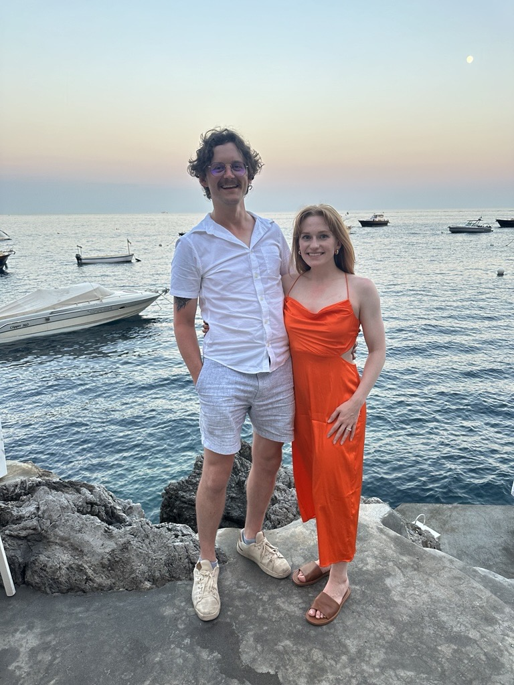
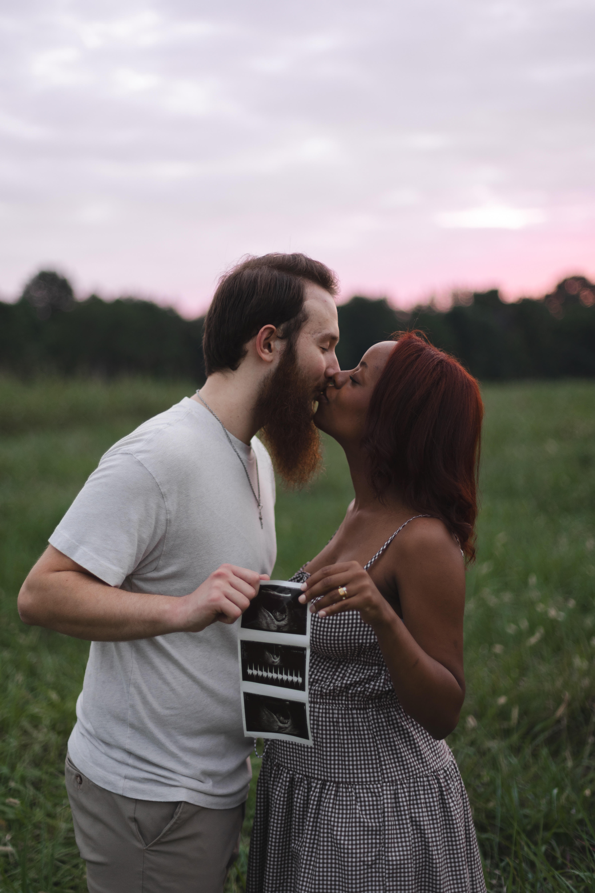

# GGCMaps - 8/25/2025

## Team Lost

### Description / Abstract
  - The GGC Maps Project is a web-based tool that helps students, visitors, and staff navigate Georgia Gwinnett College’s campus. It rebuilds the legacy GGC Maps app using a modern framework to ensure responsiveness, accessibility, and easier maintenance. The new system will reuse existing SVG floorplans and JSON data while adding support for modular plug-ins, making it extensible for future features. The project’s primary objective is to deliver a clean, maintainable, and future-proof mapping solution for GGC.

### Links
 - The [legacy GGC Maps project](http://ggcmaps.com/#Campus) is available for reference, but this repository focuses on rebuilding it with modern frameworks and a modular design.

### Technologies
- Next.js with TypeScript
- HTML5 / CSS3 for layout and styling
- SVG for scalable building maps
- JSON for room and building metadata
- GitHub for version control and collaboration

### Working Features
- Display of campus buildings and indoor maps (from SVG files)
- Clickable rooms and spaces with highlights
- Search by room number or building
- Overlay features (e.g., fire escapes, elevators, vending machines)
- Modular plugin system for future extensions (e.g., accessibility overlays, GPS integration)

### Prerequisites
- Node.js 18.17 or newer (20.x LTS recommended)
- npm (comes with Node)

### Installation Steps
1. Clone the repository
2. Run `npm install`

### Running Steps
1. Run `npm run dev`
2. Open http://localhost:3000

### Other Project Explanations
- Client: Dr. Cengiz Gunay, Georgia Gwinnett College
- Goal: Rebuild the existing GGC Maps app in a modern, modular, and maintainable way
- Future Enhancements (optional): multilingual support, GPS positioning, campus navigation between buildings, accessibility overlays

### Team Members  
**Fall-2025**

**Team Name:** *Lost* 

### Team Members  

| Photo | Name              | Roles & Responsibilities                                                                 | Contribution % |
|-------|-------------------|-------------------------------------------------------------------------------------------|----------------|
|  | **Brendan Morrissey** | Code Architecture / Lead Programmer (60%) · Programmer (20% ×2)   | 100% |
|      | **William Stein**     | Data Modeling (60%) · Documentation Lead (20%) · Programmer (20%) | 100% |
|       | **Karen Armendariz**  | Testing Lead (60%) · Client Liaison (20%) · Programmer (20%)      | 100% |
|     | **Justin McCabe**     | UI/UX Designer (60%) · Project Manager (20%) · Programmer (20%)   | 100% |

### Team Roles 

#### Justin McCabe
- UI/UX Designer
- Project Manager
#### William Stein
- Data Modeling
- Documentation Lead

#### Karen Armendariz
- Testing Lead
- Client Liaison
- Programmer

### Project Flyer and video (at the end of the semester)

